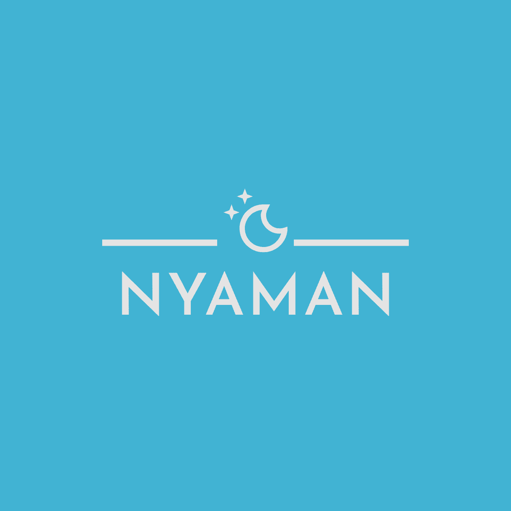
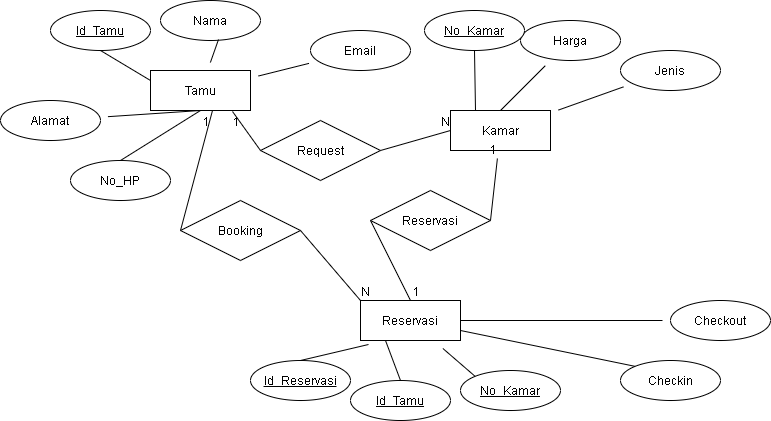

<!-- Logo Proyek -->
 

  

  <h3 align="center">NYAMAN</h3>

  

    Website untuk reservasi kamar hotel
  

<!-- Daftar Isi -->

  
<h2 style="display: inline-block">Daftar Isi</h2>

  <ol>
    <li><a href="#anggota-tim">Anggota Tim</a></li>
    <li><a href="#fungsi">Fungsi</a></li>
    <li><a href="#tujuan">Tujuan</a></li>
    <li><a href="#target-pengguna">Target Pengguna</a></li>
    <li><a href="#mockup-kasar">Mockup Kasar</a></li>
    <li><a href="#skema-database">Skema Database</a></li>
  </ol>

<!-- Anggota Tim -->
## Anggota Tim
| NPM           | Name                              |
| ------------- |-----------------------------------|
| 140810200043  | Johanes Bagus Prasetyo            |
| 140810200047  | Kharisma Fitri Nurunnisa Siahaan  |
| 140810200065  | Hanifan Ayusti Khairunnisa        |

<!-- Fungsi -->
## Fungsi

Website untuk membuat reservasi kamar hotel.

<!-- Tujuan -->
## Tujuan

Mempermudah pengguna dalam proses pemesanan kamar hotel.

<!-- Target Pengguna -->
## Target Pengguna

Masyarakat umum yang sedang bepergian dan membutuhkan kamar hotel.

<!-- Mockup Kasar -->
## Mockup Kasar

https://www.figma.com/file/oiCZgjMfT5uTzMdBUxGie9/Nyaman?node-id=3%3A4

<!-- Skema Database -->
## Skema Database

